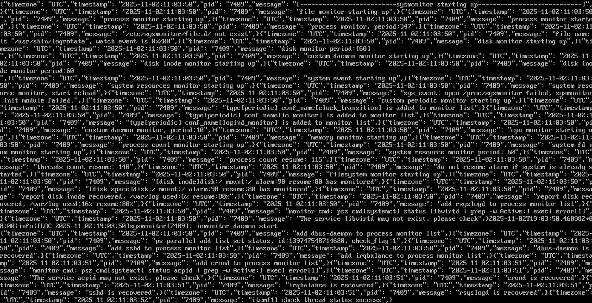

# hack_the_burgh

Repository for getting cooked.

## OpenEuler: Sysmonitor

**Source code:** https://gitee.com/openeuler/sysmonitor

**Dependency:**

- https://gitee.com/Janisa/huawei_secure_c
- https://gitee.com/openeuler/libboundscheck
- CUnit (https://cunit.sourceforge.net/)

### Building Sysmonitor

#### Installing dependencies

##### SecureC

```bash
# Clone the source code
git clone https://gitee.com/Janisa/huawei_secure_c.git
cd huawei_secure_c/src

# Build the library
make

# Link the .so file and header files to appropriate directories
cd ../lib
sudo ln -s $(pwd)/libsecurec.so /usr/local/lib/

cd ../include
sudo ln -s $(pwd)/* /usr/include/
```

##### LibBoundsCheck

```bash
# Clone the source code
git clone https://gitee.com/openeuler/libboundscheck
cd libbounscheck

# Build the library
make

# Link the .so file to the approriate directory
cd ../lib
sudo ln -s $(pwd)/libboundscheck.so /usr/local/lib/
```

##### CUnit

CUnit library is publicly available. Install it using the relevant package manager on your environment.

```bash
sudo apt-get install libcunit1 libcunit1-doc libcunit1-dev
```

#### Building the Source Code

```bash
# Clone this repo and make the build directory
cd sysmonitor/sysmonitor-1.3.2/
mkdir build
cd build

# Run cmake
cmake ../

# Run make
make
```

You will see the `sysmonitor` main binary in `build/src/sysmonitor`.

## Cockpit Plugins

### Cockpit

**Source code:** https://github.com/cockpit-project/

#### Installing Cockpit on OpenEuler

**Instructions:** https://forum.openeuler.org/t/topic/7906

```bash
sudo dnf upgrade -y
sudo dnf install cockpit
sudo systemctl enable --now cockpit
sudo firewall-cmd --add-port=9090/tcp --permanent
sudo firewall-cmd --reload
```

#### Installing plugins

Plugins can be either installed as a user at:

`~/.local/share/cockpit`

or as system at:

`/usr/share/cockpit/` or `/usr/local/share/cockpit/`

### Plugins

Two plugins were developed based off the
`https://github.com/cockpit-project/starter-kit` repository.

Plugins were developed with react and with the help of ChatGPT including the
running scripts.

#### Getting the plugins on OpenEuler

OpenEuler was run in a VM. To build the plugins and their dependencies the
`Makefile` of the `starter-kit` repository was used.

1. Checkout the repository on your host machine
2. Upload the scripts onto the VM by running `rsync -avr scripts root@<hostname>:/usr/local/share/cockpit/`
3. Export the following variable: `export RSYNC=root@<hostname>` to point to the
   root user of your guest machine
4. `cd` into each plugin folder and run `make watch` to build and deploy the
   plugin to the VM


### Testing the plugins

By using ChatGPT we quickly created two test scripts that test the alarm
functionality of the plugins. The first script available in
`tests/make_zombies.c` can be compiled with a C compiler and run as
`tests/make_zombies 2000` to launch 2000 zombie processes. Similarly, the
`tests/memory.c` script will create 40 dummy processes each using 50 MB of
memory in order to simulate a load on the system.

Furthremore, we configured the system monitor by setting appropriate values in the following files:

- `/etc/sysmonitor/zombie`: Change alarm, resume and poll frequency values
- `/etc/sysmonitor/memory`: Change alarm, resume and poll frequency values
- `/etc/sysconfig/sysmonitor`: Enable zombie process monitoring

Following images shows the visualisation of the dashboard for the memory and zombie process.


* Following image shows the developed visualisation of the logs plugin.


* Image shows the alarm board for the different logs.


* The CI logs can be observed using the local CI.



